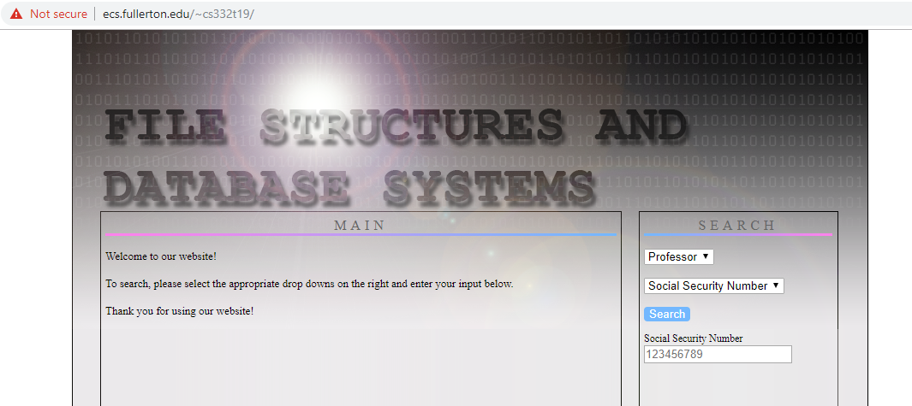
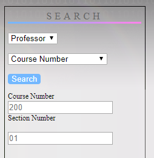
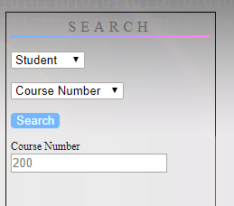

##### SchoolDatabaseSimulation created by Jonathan Ishii, Johanna Nguyen, Michael Lam

# School Database Simulation

  Simulates a school database for professors and students to use. The project will use a MySQL database and PHP, CSS, JS, and HTML to build a web database application.

  Website URL: http://ecs.fullerton.edu/~cs332t19/

## Getting Started

  Languages used: PHP, HTML, JS, CSS, MySQL (database)
  The program was coded using a basic text editor and loaded into the school server using WinSCP.

### Prerequisites

You will have to install any browser that supports HTML.
This will only work if the school doesn't delete our database on the school server since we directly query into it.

## Break down of the program

### index.html/index.php

This is where the user interfaces with the program. All of the framework are in these documents.

All of the scripts to interface with the database are inside of the php tags in the index.php file.

#### Why are the index.html and index.php files so similar?

The project required us to have a index.html as our homepage, but in order to run php we had to have the php file ending.
This is why we redirect the users to the index.php page from the index.html page.

### assets

This is where all the styling and javascript files are kept.

### DDL.txt

DDL.txt are the queries that were used to create the database in the school server.

### InterfaceQueries.txt

InterfaceQueries.txt are the specific queries that are used to query into the database (required by the professor).

### populateDatabaseQueries.txt

This is a list of all queries that were used to populate the database with dummy data so that when the queries are run data is returned to the user.
When adding data to this file please make it clear what needs to be added by appending a line of "=" followed by all your queries you wish to be added.

## Screenshots of the interface

#### Welcome/Homepage for the website

#### Different Search Options

  
  
  
  

#### Search Results
